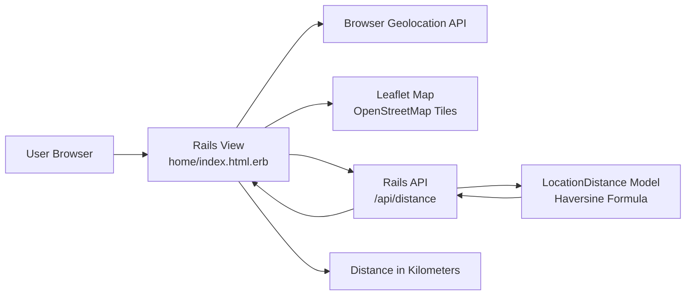

# Application Architecture

## Description

The Rails view renders the main page and loads the map. When the user clicks
the location button, the browser asks for geolocation permission. The page sends
the latitude and longitude to the Rails API. The Rails model calculates the
distance to the KPU Surrey Library and the page updates the map and distance
display.
